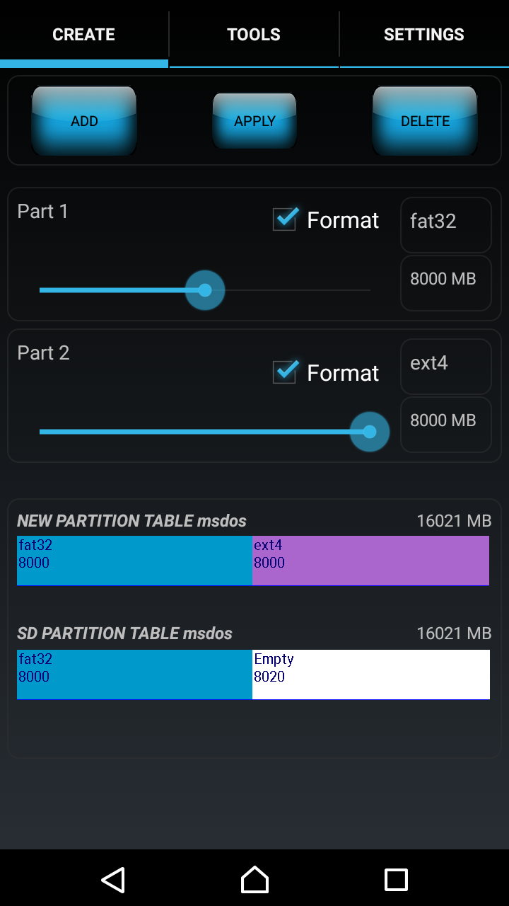
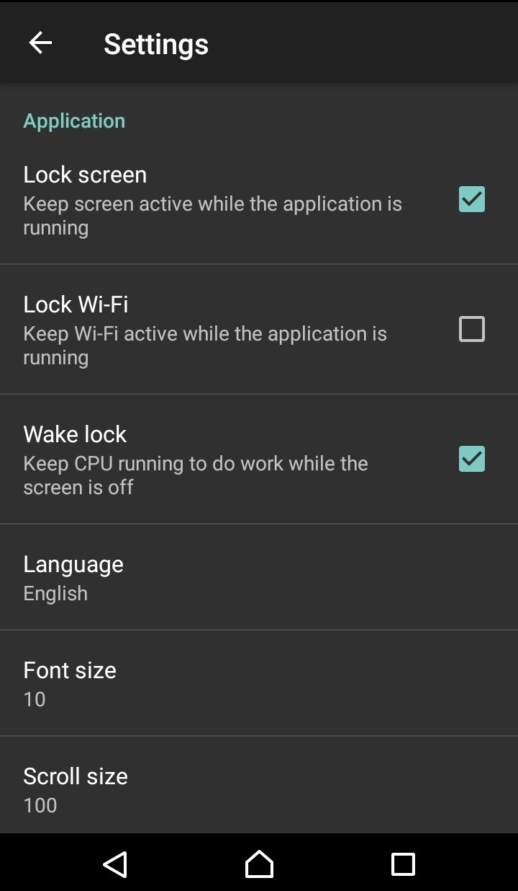
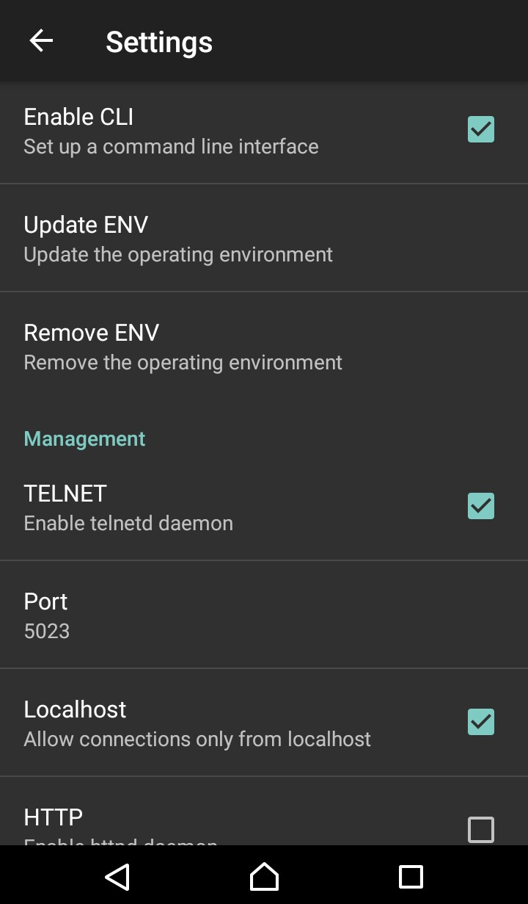
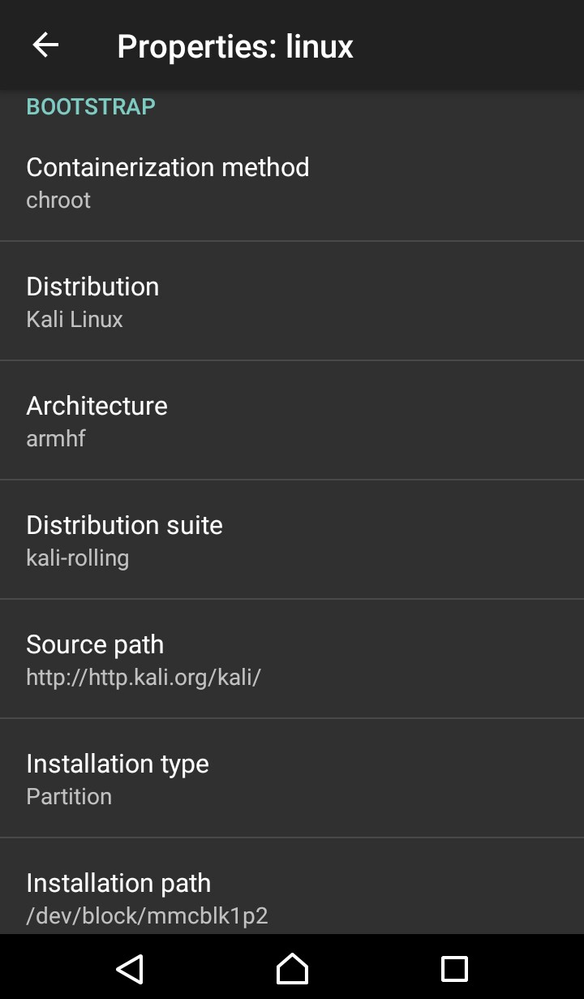
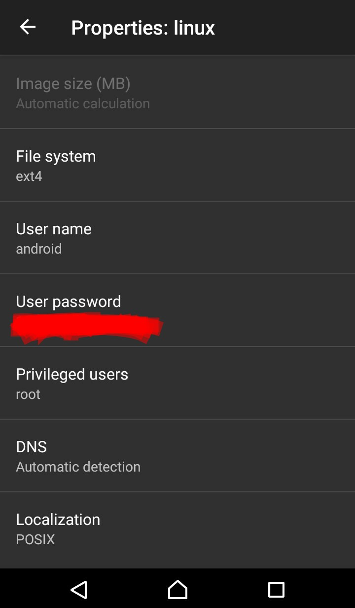
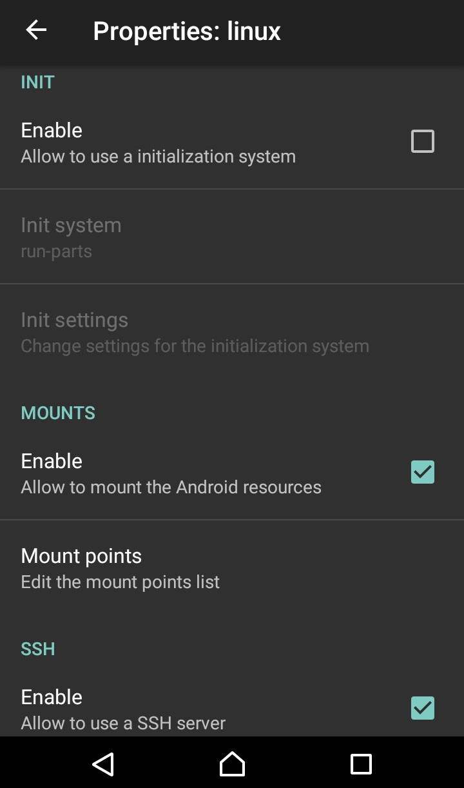
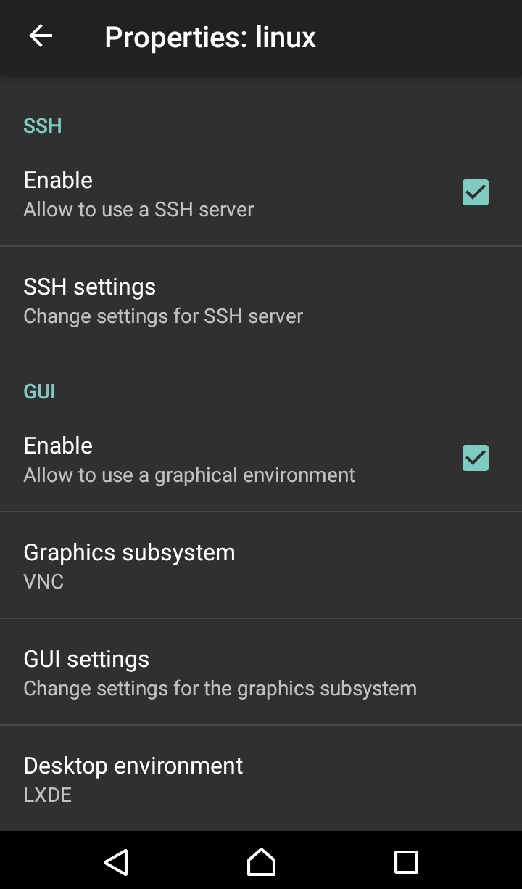
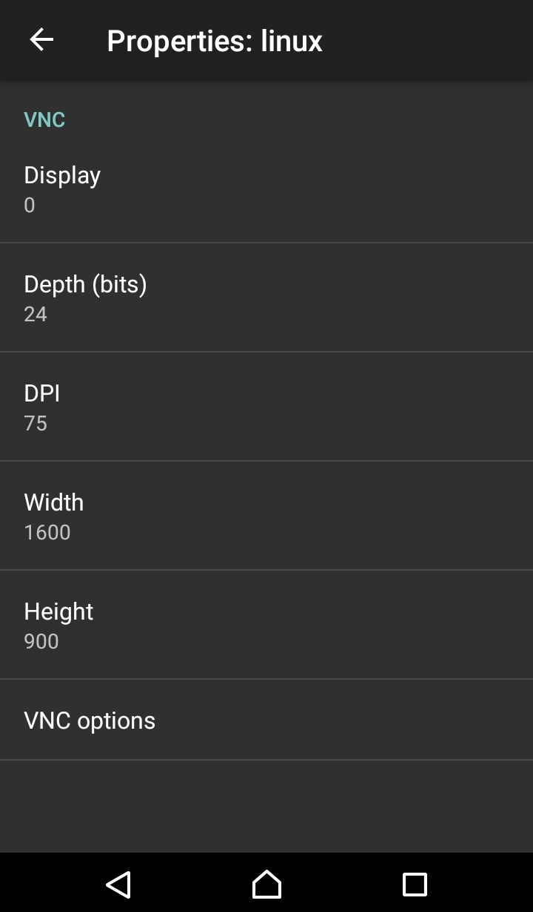

# [筆記] Linux Deploy

---

## 關於這份文件

[Linux Deploy](https://play.google.com/store/apps/details?id=ru.meefik.linuxdeploy) 是由一位俄羅斯的開發者 [meefik](http://meefik.ru/blog/categories/linuxdeploy/) 製作的一個 Android App。

透過 Linux Deploy，你可以在你的手持式裝置上安裝一個 Linux 發行版。Linux Deploy 沒有太多文件，比較值得參考的是官方 [github](https://github.com/meefik) 所附的 [WiKi](https://github.com/meefik/linuxdeploy/wiki/_pages) 頁面，但它的 WiKi 內容像是任何人都可以撰寫，所以文章撰寫風格很...嗯~ 品質不一。

這份文件是我將官方的 [WiKi](https://github.com/meefik/linuxdeploy/wiki/_pages) 頁面內容稍微粗略翻譯的結果。我沒有將每一篇 WiKi 獨立成一篇文章，而是全都塞進這份文件中，以便前後比對。

基本上第二標題的內容原本都來自於 WiKi 上的某一篇分享。我沒有全部都翻譯，一些不熟悉的內容甚至翻譯得不是很好 XD。有些我認為不重要的文章統一列在最後一個 "有需要再看" 章節中。

這篇文章中所指稱的 "Linux", "GNU Linux", "installation", "instance" 幾乎都是指透過 Linux Deploy 這個 App 所安裝的 Linux distro。因為每一篇的作者都不同，用詞也沒有統一，先在此說明。


## 如何解決問題

嘗試進行故障排除之前，請確保先嘗試以下方法。

1. 安裝 meefik 的 Busybox -- 您必須安裝 meefik 的 Busybox，因為它使用的 components 在 general Busybox 中不可運作
2. 這個 application 需要 root
3. 使用最新版的 Linux Deploy -- 本文是根據最新版本的 Linux Deploy 編寫的
4. 有時，只要重新啟動智能手機即可解決問題

Q1: 為什麼 Framebuffer 無法運作?
A1: 目前 Framebuffer 僅在 Linux (ex: Debian) 上可運作，而且沒有太多設備支援 Framebuffer。

請參考下面的鏈接: https://github.com/meefik/linuxdeploy/wiki/Framebuffer-notes

Q2: 安裝時出現下面的錯誤:

> ">>> deploy"  
> "<<< deploy"  

A2: 安裝 Busybox 之後，單擊 "Settings ->"，將 PATH 設定為 `/system/xbin`，然後點擊 "Update ENV"。如果這樣沒有用，則將 disk image 大小調整為 2GB (2048MB)，然後重試


Q3: 發生 "Permission Denied"  
A3: developer 正在研究這個問題


## 性能測試

* class 10 SD card
* Samsung Galaxy S II
* Debian/wheezy/armhf


**SD card filesystem read/write 速度**

|(MB/s)|vfat|ext2|ext4|ext2(loop)|ext4(loop)|
|:----:|:--:|:--:|:--:|:--------:|:--------:|
|read  |14.1|14.9|14.9|17.0      |17.2      |
|write |12.0|3.9 |16.6|7.4       |8.8       |

ps: ext4 表現比較平均


**安裝耗時以及安裝後消耗的空間**

|GUI         |文字模式|XTerm|LXDE |Xfce |GNOME|KDE  |
|:----------:|:-----:|:---:|:---:|:---:|:---:|:---:|
|安裝時間     |0:12   |0:14 |0:19 |0:20 |0:55 |1: 20|
|消耗空間     |260MB  |290MB|450MB|495MB|1.3GB|1.3GB|


## Linux Deploy 的選項說明

Linux Deploy 可設定的 options:

* **Options -> Install (Properties -> Install)**
	* 安裝一個全新的 GNU/Linux system。安裝時使用的選項如下:
* **Options -> Reconfigure (Properties -> Reconfigure)**
	* 允許您 reconfigure 已經安裝的系統。當前系統的所有設定將被重置，包括重置使用者​​密碼。
* **Options -> Distribution (Properties -> Distribution)**
	* 指定要安裝的發行版(distribution)。一些系統的 deployment options 會根據這個選擇而變動 (相依性)。
* **Parameters -> Distribution suite (Properties -> Distribution suite)**
	* 允許您指定 distribution 中的某個可用版本。
* **Options -> Architecture (Properties -> Architecture)**
	* architecture 可以選擇 `armel` 或 `armhf`。It indicates which build of the distribution to install.
	* armhf 和 armel 的差別在於是否支援硬體浮點運算 (hardware floating point operations)。armel 僅支援軟體浮點運算。
	* 由於現代處理器進行了優化，使得 armhf 可能會比較快。但如果處理器不支援這種指令集 (instructions) 也無法運作。
	* 需要注意的是某些舊版本的 distribution 不支援 armhf 只有 armel，例如 Debian Squeeze。
* **Options -> Mirror URL (Properties -> Mirror URL)**
	* 列出 distribution 的 repository URL
* **Parameters -> Installation type (Properties -> Installation type)**
	* 決定安裝方式，有四種安裝方式:
		* `安裝 distro 到一個 disk image loop file` (預設選擇)
		* `安裝 distro 到記憶卡中的一個分割區`
		* `安裝 distro 到一個資料夾`
		* 客製化安裝 distro 
	* 客製化安裝方式將跳過建立 disk image 和 file system file 的步驟，This allows installation to be performed on pre-prepared media.
		* 例如，它可以是一個特殊檔案系統的映象檔 (或是一個檔案系統的分割區)。
			* 這種狀況下，你可以指定任何可能的媒體裝置當作安裝路徑 (ex: 檔案、記憶卡中的區段，或是一個資料夾)，媒體的型態會被自動指定。
			* 在這種模式下安裝必須非常小心。原始的媒體 (partition, directory) 中可能已經有現存的檔案，安裝的行為發生在現有的媒介上，這可能導致安裝時發生衝突。
* **Parameters -> Installation path (Properties -> Installation path)**
	* 安裝路徑，可能是一個檔案、或一個 block device，或是資料夾。這取決於你所選擇的安裝方式。
	* 預設情況下，這個路徑將指定到記憶卡中的一個檔案 (distro 映像檔)。如果記憶卡的掛載路徑不是 /mnt/sdcard，你需要修正為正確的掛載路徑。安裝的過程中將會根據 Image size (MB) 的設定產生一個映像檔。
	* 如果你要將系統安裝在記憶卡中的分割區，你需要指定分割區的路徑，ex: /dev/block/mmcblk1p1.
		* 從選單中的 Information (SysInfo) 可以列出可用的 sections
		* 你可以在分割區中指定不同的 sections，例如一個給 GNU/Linux system 使用，剩下的給 Android 使用
		* 如果分割區已經安裝了 GNU/Linux system，則不能再給 Android 或其他系統使用
		* 第三個安裝選項，是將 GNU/Linux 安裝在 Android 系統中的一個資料夾下。如果基於某種原因，你已經 mount 了 ext2/ext3/ext4 在 Android 系統中，你可以使用這種方式來部署 GNU/Linux system
* **Options -> Image size (MB)**
	* 如果安裝方式選擇 "installing to an image file"，則可使用 MB 指定 disk image file 的大小。
	* 如果沒有 GUI，建議大小是 512MB
	* 如果使用 LXDE，建議大小是 1024MB
	* 當你打算將 Linux 安裝到 FAT32 格式的記憶卡時，這個 image 大小不應該超過 4095MB
* **Options -> File system (Properties -> File system)**
	* 用來指定安裝時要使用哪一種 file system。可能設定於 image file，或是記憶卡中的分割區。
	* 如果設定為 "Auto detect" 則將會自動選擇一個適合的 file system
	* 如果安裝方式為 "installing to a directory"，則會忽略這個設定
* **Parameters -> User name (Properties -> User name)**
	* 指定 Linux 系統中的 user name
	* 一些 GNU/Linux distributions 中有些系統保留的 user name，盡量不要使用他們
	* 當然，你可填寫 root 產生 superuser
* **Parameters -> DNS server (Properties -> DNS server)**
	* 指定 DNS server, ex: 8.8.8.8
	* 可用空白、',' 或 ';' 隔開多個 DNS server 設定
	* 如果空白，則每次啟動 Linux 都會執行自動偵測
* **Options -> Localization (Properties -> Localization)**
	* 設定系統的本地化語言
* **Options -> Desktop environment**
	* 選擇桌面環境
	* 安裝或 reconfiguration Linux 的過程中，桌面環境設定將被寫入 user profile
	* 如果選擇 "Other"，則等於這個設定不會被執行。通常適用於想手動啟用桌面環境的狀況
* **Options -> Select components (Properties -> Select components)**
	* 選擇安裝那些套件。ex: SSH server, VNC server, desktop environment, X server
	* 如果你沒有選用某些套件，則可能無法啟用對應的服務 (廢話 XD)
* **Options -> SSH (Properties -> SSH)**
	* 允許 SSH 服務器在系統啟動時啟動
		* 所以上面的 "Select components" 你要先勾選 "SSH server"，某則沒用。
* **Options -> SSH settings (Properties -> SSH settings)**
	* 會開啟 SSH server 設定頁面
* **Options -> GUI (Properties -> GUI)**
	* 這裡可以選擇桌面環境要使用哪一種 graphics subsystem 啟用
		* VNC
		* external X-server
		* frame buffer
* **Options -> Graphics subsystem (Properties -> Graphics subsystem)**
	* 有三種 graphics subsystems 可以用來啟用桌面環境
		* VNC
		* X Window 系統
		* Frame Buffer
	* 選擇 VNC 子系統可以讓您透過 VNC server 執行 GUI，您可以通過第三方 VNC client 軟體連接到該 server
	* 選擇 X-Window System 使您可以通過 外部 X server 運行 GUI
	* 選擇 Frame Buffer 子系統可以透過 video driver 直接顯示 GUI（繞過 Android）。但並非所有設備都支援此模式。
* **Options -> GUI settings (Properties -> GUI settings)**
	* 開啟 graphics subsystem 的設定頁面
* **Options -> Custom scripts**
	* 允許您在 Linux 系統啟動時自動運行該系統中的任何一個 script (應該是個現存於 Linux fs 的 script file)。
	* 啟動和停止系統時，"啟動" 或 "停止" 將分別當作參數傳遞給 script
	* ps: 感覺很像 init.d/ 中的 scripts 腳色
* **Options -> List of scripts (Properties -> List of scripts)**
	* 列出用於 autorun 的 custom scripts。可以使用快捷選單編輯該 list
* **Options -> Mounting (Properties -> Custom mounts)**
	* 允許您在 Linux 系統上掛載 Android 系統的 directories, images 或 partitions
* ** Options -> Mount points (Properties -> Mount points)**
	* 您可以指定一個目錄（ex: /mnt/sdcard）以將外部記憶卡 mount 到啟動系統
	* 也可以指定一個 block device（ex: /dev/block/mmcblk1p2）以將記憶卡中的某個分割區掛載到啟動系統


## GNU Linux安裝說明

透過 Android Linux Deploy App 安裝 GNU/Linux 發行版的說明：

1. 手機必須透過 WiFi 連接到 internet。安裝是透過 internet 安裝的，無法連出 internet 就無法完成安裝
2. `確定你的手機有 superuser (root) 的權限`。安裝並執行最新版本的 Linux Deploy App
3. 透過 App 的設定更新 App 的 working environment：**Settings -> Update ENV (Settings -> Update ENV)**
	* 為了使 App 能正常運作，必須要有 ENV (working environment)，它在設備上會佔用約 2MB 的空間
	* environment 目錄位於 `/data/local/linux`。除非有特殊原因，否則不應更改它
	* Linux 系統不會放在 environment 目錄中 (即: /data/local/linux)
	* 啟用 **Settings -> Screen Lock** 可以讓螢幕、WiFi 和處理器不會進入睡眠模式
4. App 支援 profiles 的管理，每個 profile 可以儲存一個 Linux instance 的設定
	* 您可以點選主畫面中的標題圖示開啟 profile management 視窗，並在上面快速切換不同的 Linux instances。
	* App 預設會建立一個名為 "Linux" 的 profile 文件
	* 點擊 profile 最右邊的 parameters 按鈕，可用來設定安裝和執行 GNU/Linux distribution kit 時所需的選項（請參閱 "Linux Deploy 的選項說明"）
5. 從 parameters 視窗中的: **Options -> Install (Properties -> Install)** 執行 Linux distro 的安裝。安裝 log 會顯示在 App 主畫面中。平均安裝時間約 30 分鐘。
6. 如果安裝完成且沒有錯誤，可以點 "START" 按鈕啟動 Linux 系統。並且一併啟用你在參數定中勾選啟用的服務 -- ex: SSH, VNC
7. 要透過 SSH 訪問 Linux 系統的 console，您需要安裝 SSH clinet，ex: [ConnectBot](https://zh.wikipedia.org/wiki/ConnectBot)。要進入 Linux 桌面，你需要裝 VNC client，ex: [Jump Desktop](https://jumpdesktop.com/) or [VNC Viewer](https://www.realvnc.com/en/connect/download/viewer/)
	* 透過 VNC 連接到 Linux 系統的預設參數為：
		* Host: 127.0.0.1
		* Port: 5900.
	* SSH 和 VNC 的預設密碼為 `changeme`
	* 您可以使用 passwd 指令從 console 更改當前 user 的密碼，也可以使用 vncpasswd 命令更改 VNC 密碼
	* 要以 root 執行程式，請使用 sudo 指令（ex: sudo synaptic）
	* 預設情況下，沒有為 root 設定密碼（除非在 instance parameters 中將其指定為 username）
	* 您可以使用 sudo passwd root 為 root 設定密碼
8. 只需按 STOP 按鈕，就能停止 Linux 系統、並停止在其下運作的所有服務以及卸載磁碟


## 在不重新安裝系統的情況下調整映像文件的大小

要為 Linux Deploy 增加 image file 的大小，必須首先 expand 現有的 image，然後將 file system expand 為新的大小。例如，要將 image 增加 3000MB，需要執行以下指令:

```
dd if=/dev/zero bs=1048576 count=3000 >> /mnt/sdcard/linux.img  # 1048576 = 1MB
e2fsck -f /mnt/sdcard/linux.img
resize2fs /mnt/sdcard/linux.img
```

最好先將原本的 image 做一個 backup copy


## 啟動 Raspbian MATE 發行版

Raspberry Pi based-on Debian 製作了 Raspbian MATE 發行版，使用 MATE 桌面環境。這個 distro 可以透過 Linux Deploy 的協助在 Android 上運行。

指示:

1. 從官方網站下載 image：rpi_pisces_mate_r2.zip
2. 從完整 image 中取出 `第三個分割區` 的 image（在 Linux 下可執行）: 
```
kpartx -v -a rpi_pisces_mate_r2.img
dd if=/dev/mapper/loop0p3 of=/tmp/rpi_pisces_mate.img bs=1M
```
3. 將 rpi_pisces_mate.img 文件複製到手機的記憶卡中
4. 在 Linux Deploy App 中，建立一個新的 profile 文件，並在 parameters 中指定:
	* distribution - Debian
	* version - wheezy
	* installation type - file
	* installation path - path to the rpi_pisces_mate.img file
	* username - raspbian
	* desktop environment - Other
	* install GUI - Yes
	* Reconfigure (Options -> Reconfiguration).
5. 使用 App 主畫面中的第二個按鈕啟動 Linux
	* 通過 SSH 連線登錄帳密 (raspbian / changeme)
6. 設定透過 VNC 自動啟動桌面環境:
```
cat << EOF > ~/.vnc/xstartup
XAUTHORITY=\$HOME/.Xauthority
LANG=zh_TW.UTF-8
export XAUTHORITY LANG
echo \$\$ > /tmp/xsession.pid
mate-session
EOF
chmod 755 ~/.vnc/xstartup
```
7. 從 App 界面重啟 Linux。然後透過 VNC 連線，密碼: changeme


## 安裝 Kali Linux 指南

### 安裝

**安裝 Linux 的最佳方法是替它建立一個單獨的 partition**


1.插入記憶卡（至少 16GB, class10）

2.安裝 [Aparted](https://play.google.com/store/apps/details?id=com.sylkat.AParted&hl=en_US&gl=US) App for Android

3.按照說明進行操作，並將至少 8GB 的空間格式化為 ext4，用來安裝 Linux，其餘的空間可以自己利用


4.然後打開 Linux Deploy App，向右滑動並進入 settings

5.enable (lock screen), (wake lock), (CLI), (TELNET), (Localhost)





6.點擊 **REMOVE ENV** 和 **UPDATE ENV**

7.返回並點擊下載圖示，然後設定如下：











>**Contain method:** chroot           (我使用 proot 沒有成功)
>**Distribution:** Kali Linux
>**Architecture:** Armhf
>**Distribution suite:** Kali-rolling (更好，更新)
>**Installation type:** partition
>**Installation Path:** /dev/block/mmcblk1p2
>(像我這樣設定就可以。如果你跟我不一樣，在 Aparted App 的第一行中設置 ext4，然後將 p2 替換為 p1。p1, p2 表示 partition number)
>**File system:** ext4
>**Username:** Android
>**User Password:**            (只用於 VNC 連線使用)
>**Privileged user:** root
>**DNS:** Automatic
>**Localization:** POSIX
>**INIT:**                     (如果您知道如何使用它，可 enabled 它，否則將其禁用 disabled)
>**MOUNTS:**                   (如果您知道如何使用它，可 enabled 它，否則將其禁用 disabled)
>**SSH:** enable               (leave settings unaffected)
>**GUI:** enable
>**Graphics subsystem:** VNC   (建議使用，比其他的方式還好)
>**GUI settings Depth:** 24Bit
>**DPI:** 75
>**width:** 1600 **height:** 900
>(我設定這個數字是因為如今 16:9 是一個很好的寬高比，並且在許多顯示器中都是原生的，而且對於執行較大的程式也不會遇到問題，因此我建議將其更改為預設值。該分辨率與某些超出邊界的 Apps 不相容) :-(
>**VNC Options:**              (leave unaffected)
>**Desktop environment:** LXDE (看你想用那一種，但這是我的建議)

8.返回畫面，單擊三點圖示選單，然後點擊 install 等待安裝完成

9.使用 VNC viewer App（推薦 com.realvnc.viewer.android）連線到 127.0.0.1


### TROUBLESHOOTING

**1. 某些 packages 無法 retrieved/validated 並得到 error/ignored，因此 Linux 安裝不完整**

檢查您的 Internet 連接狀況，確保它穩定且快速。

某些 packages 受到限制 (restricted) 或過濾 (filtered)（503），請嘗試以下方法：

* 安裝（Orbot）並進入 options 中啟用透明代理 (transparent proxy)
* 然後啟動 Tor 再開始安裝


**2. 當我按下 stop button，Linux 仍在運作，無法停止/unmount 某些項目**

在第一個 stop command 結束之後再按一次　stop button，然後再試一次...直到成功為止（the container is not mounted）


**3. 應用程式無法透過點擊 icon 來啟動**

有些應用程式需要 sudo，如果不在 su 模式下，有些應用程式甚至不會有反應（ex: synaptic package manager or Zenmap）

打開 terminal 輸入 "sudo"，然後輸入應用程式的命令（例如 "synaptic"）。該指令應該立即運作


**4. 格式化完成後，我的 SD 卡損壞了**

首先嘗試製作 "fat32" partition

eject SD 卡並再次插入，現在它應該是個普通的 SD 卡

請記住選擇 "use as a portable storage"，以便 Android 不會再次將 SD 卡重新格式化為預設格式


**5. mouse 游標 icon 被替換為（X）圖示**

點開 Windows 上的 "開始" 選單，到 "perfences"，然後點選 "customize look and feel" 重新設定


### FAQ

**1. Contain 方法：該使用 proot 還是 chroot？**

proot 與 chroot 相同，但 proot 不需要 root 訪問權限。不過我執行 proot 沒成功，所以如果您有 root 權限，就使用 chroot


**2. Architecture：我該選擇哪一個？**

前往 https://www.gsmarena.com/ 搜尋你的手機型號，找出它的 cpu arch，然後選擇您的 cpu arch。

* ARMEL: for 32Bit devices at ARMv4 
* ARMHF: for 32Bit devices at ARMv7 or higher
* ARM64: for 64Bit devices with ARM chipset
* i386:  for 32Bit devices with Intel or AMD CPU
* AMD64: for 64Bit devices with Intel or AMD CPU


**3. Distribution suite：我該選擇哪一個？**

如果是數字，則越高越好，越穩定。

如果它是名稱，請訪問發行網站，查看其最新的 build codename 是什麼，然後選擇該名稱。

例如：Kali Linux 新的 build name 為 "Kali-rolling"，Ubuntu 新的 build name 為 "yakkety"


**4. installation type：應選擇哪一種？**

我人建議使用上面文件提到的 installing as "partition" 進行安裝，但下面將介紹其他安裝方式

* **FILE：**將 Linux 安裝在副檔名為 ".img" 的 "image" 檔案中
	* 請記住，fat32 的 SD 卡不允許單個檔案超過 4GB，因此這是個限制
	* 除非您將 SD 卡重新格式化為 "exfat"（但你的手機必須支援這種格式才有用）
* **Directory：**將 Linux 安裝在目錄中。就像在 Windows 上安裝應用程式一樣
	* 請記住 fat32 的 SD 卡不允許檔案路徑超過 260 個字元，因此請考慮在 SD 卡的根目錄中使用簡短的資料夾名稱
* **Partition：**將 Linux 安裝在單獨的分割區中，而不會被 Android 系統觸及到
	* Android 不能掛載 ext4，因此您可以確定 Linux 不會受 Android 損害，並且分割區位於 Android 不可觸及的地方
	* 我建議採用這種方式，因為當你使用 installing as file or directory 安裝後，因為某些 "Booster/cleaner" Apps 可能會認為那些安裝 linux 後的 file or directory 是暫存檔或是多餘的檔案，因而刪除了 Linux @@!
* **RAM：**在您的 RAM 安裝 Linux。請記住，以這種方式安裝會需要足夠大的 RAM，我不知道這是否是個好主意，因為我沒有嘗試過，請確保它會非常快，但 RAM 通常只是檔案的臨時存放區...


**5. File System：應選擇哪一個？**

我建議使用 "ext4"，因為它更好，也更新。在此了解更多資訊：[Linux File Systems: Ext2 vs Ext3 vs Ext4](https://www.thegeekstuff.com/2011/05/Ext2-Ext3-Ext4/)


**6. Desktop environment：我應該選擇哪一個？**

我建議使用 LXDE，因為它更快且輕便。詳細資訊：[The Best Lean Linux Desktop Environment: LXDE vs. Xfce vs. MATE](https://www.makeuseof.com/tag/best-lean-linux-desktop-environment-lxde-vs-xfce-vs-mate/)


**7. 為什麼 WiFi 滲透測試 (pen-testing) 應用程式無法運作？(aircrack-ng, fern, reaver etc...)**

這些應用程序需要將 WiFi driver 設定為一種稱為 "monitor" mode 的特殊模式，以便它們可以進行 debugging，從而可以執行任何操作。

但是，mobile device 的造商通常不會在其 WiFi modules 中提供對 "monitor" mode 的支援，這就是它們無法正常運作的原因。

試試這個 App，也許您的手機具有 "monitor" mode:[AirMon](https://play.google.com/store/apps/details?id=net.maxters.droid.airmon)


## 在 SD 卡中使用 ext4 並在手機啟動時從 Android 卸載它

[安裝 Kali Linux 指南](https://github.com/meefik/linuxdeploy/wiki/Installing-Kali-Linux-Guide)有個建議，可讓您使用ext4 格式化 SD 卡，然後在那張卡上安裝 Linux。

但是，在我所使用的 Android 7.1.2 中，情況卻不是這樣：

> Android 現在不能直接掛載 ext4，因此你不需確保 Linux 不受 Android 系統的任何侵害，並且將 Linux 安裝於 Android 無法觸碰的地方。

在我的 Android 中，當你首次建立並格式化 ext4 分割區時，Android 無法掛載它。但是一旦手機重啟，它卻神奇地掛載了它！我找不到方法讓 Android 不要掛載此分割區。由於這個分割區已經被 Android 掛載，因此 Linux Deploy 無法使用它。這個時候你需要先在設定中手動卸載它，然後再次啟動 Linux Deploy。最大的問題是，每次重啟手機後你都需要手動執行此項操作。

最後，我透過修改 Linux Deploy 的 cli.sh 來解決這個問題：

```
    msg -n "Checking file system ... "
    fs_check
    is_ok "skip" "done"
    # BEGIN ADDED CODE

    umounter() {
        echo "Will umount $1"
        while df -h | grep $1; do
            umount $1 2>&1
            retVal=$?
            echo $retVal
            if [ $retVal -eq 0 ]; then
                echo "Unmounted"
                break
            fi
            echo "Could not unmount. Will try again in a second."
            sleep 1
        done
    }
    umounter "/storage/5be2aa01-4744-4d10-be5e-963bc5e4914d"
    umounter "/mnt/media_rw/5be2aa01-4744-4d10-be5e-963bc5e4914d"
    # END ADDED CODE

    msg "Mounting the container: "
```

當你 telnet 到 Linuxdeploy 時，你應該會在當前目錄下看到這個 cli.sh。你可以使用 vi 編輯它。它是當你按下 start 按鈕時期望會執行的 script。

`/storage/5be2aa01-4744-4d10-be5e-963bc5e4914d` 和 `/mnt/media_rw/5be2aa01-4744-4d10-be5e-963bc5e4914d` 是當我執行 `df -h` 時，我所看到的 ext4 分割區的輸出。 

當你第一次 reboot 時，這兩個分割區的狀態可能會 busy 一陣子，因此無法 unmounted。這就是為何在 script 中會一直需要嘗試執行 unmount 直到成功。我發現有時候你必須要分別卸載這兩個分割區，這就是為什麼 script 中有兩個裝置需要卸載。

至少在我的系統中，這是一個不需要在 Android storage settings 手動卸載分割區就能啟動 Linux 的可靠方式。但如果你在 Linux Deploy 設定中啟用了 Autostart，則在手機重啟後，你的 Linux 安裝程序將自動被啟動。

我希望這些心得可以幫助到人，我有一台舊 Android 手機，透過它滿足了我 home automation 的需求。如果你的 Linux installation 對網路請求沒回應，請參考：[通過不斷的 ping 來保持 Linux Deploy 的響應速度 (responsive )](https://github.com/meefik/linuxdeploy/wiki/Keeping-Linuxdeploy-responsive-by-constant-pings-from-the-inside). 


## 通過內部不斷的 ping 來保持 Linux Deploy 的回應速度

我想一直保持我的 Linuxdeploy instance 的 WiFi 連線（防止 WiFi 休眠），以便它能回應網路請求。基於 [ssh-server (sshd) is too slow during a session #491](https://github.com/termux/termux-packages/issues/491#issuecomment-374265167) 的討論，我建立了一個 init.d 腳本放置在我的Linux 中，它將每 0.5 秒 ping local gateway。

產生一個 `/etc/init.d/pingwoke` 內容如下:

```
#!/bin/sh
# Start/stop the cron daemon.
#
### BEGIN INIT INFO
# Provides:          pingwoke
# Required-Start:    $local_fs $remote_fs $network $syslog $named
# Required-Stop:     $local_fs $remote_fs $network $syslog $named
# Default-Start:     2 3 4 5
# Default-Stop:
# Short-Description: Keeps linuxdeploy awake
# Description:       Keeps linuxdeploy awake
### END INIT INFO

PIDFILE=/var/run/pingwoke.pid

test -f $DAEMON || exit 0

. /lib/lsb/init-functions

start() {
    # code to start app comes here
    # example: daemon program_name &
    #/sbin/runuser android -s /bin/bash -c "/home/android/pinger" &

    log_daemon_msg "Starting pingwoke"

    #start-stop-daemon --start --chuid android --background \
    # --make-pidfile --pidfile $PIDFILE --exec $DAEMON

    start-stop-daemon --start --chuid android --background --make-pidfile \
     --pidfile $PIDFILE --startas /bin/bash -- -c "exec ping -i 0.5 192.168.1.1 > /home/android/pinger.log 2>&1"

    echo "hello"

    log_end_msg $?
}

stop() {
    # code to stop app comes here
    # example: killproc program_name
    log_daemon_msg "Stopping pingwoke"

    #killall pinger
    #killproc -p $PIDFILE $DAEMON
    start-stop-daemon --stop --pidfile $PIDFILE

    RETVAL=$?
    [ $RETVAL -eq 0 ] && [ -e "$PIDFILE" ] && rm -f $PIDFILE
    log_end_msg $RETVAL
}

case "$1" in
    start)
       start
       ;;
    stop)
       stop
       ;;
    restart)
       stop
       start
       ;;
    status)
       # code to check status of app comes here
       # example: status program_name
       ;;
    *)
       echo "Usage: $0 {start|stop|status|restart}"
esac

exit 0
```

將 `192.168.1.1` 換成你的 gateway ip。其實我可以從系統得到這個資訊（而不是寫 hard code），但是我懶得做了 XD

給它可執行的權限：

```
chmod ugo+x /etc/init.d/pingwoke
```

然後，將它註冊到 Linux 的啟動服務中：

```
sudo update-rc.d pingwoke defaults
``` 

完成後檢查 `/etc/rc2.d/` 裡面是否有個 `S01pingwoke` 的進入點。如果有，reboot 然後看看 ping 是否在運作:

```
root@localhost:/etc/init.d# ps -aux | grep ping
android   2687  0.0  0.1   4152   628 ?        S    15:07   0:03 ping -i 0.5 192.168.1.1
root      3345  0.0  0.1   2108   620 pts/0    S+   16:28   0:00 grep ping
root@localhost:/etc/init.d#
```

連同 [在 SD 卡中使用 ext4 並在手機啟動時從 Android 卸載它](https://github.com/meefik/linuxdeploy/wiki/Using-ext4-in-sd-and-unmounting-it-from-Android-at-boot) 所做的事情，我正在使一台舊 Android 手機成為我的家庭自動化系統中心。


## Kali Linux Mini 文檔

我知道文件很少，要找到不容易，這是我寫的（這不是官方文件，不負擔任何責任）

* 首先，您需要 "ROOT"。這是必要的。您必須在你的 Android 系統中有 root 存取權限。
* 您的裝置必須支援 loop device（按 MENU 按鈕，選擇 "狀態"。查看 log，您將看到你的裝置是否支援 loop device）

OK，你的手機可能是 FAT32，我猜您的手機內部存儲空間應該不會夠的 :)

* 買個 class10 的 32GB SD 卡。class10 之所以重要，是因為讀寫速度夠快
* 下載 mini partition tool
* 您需要 2 個分割區
	* 512MB - FAT32 當作第一個分割區
	* 將其餘的空間給 EXT2
	* 重要提示：使用 EXT2！其他類型的檔案系統將給你錯誤訊息

注意：確保分割順利進行，不要分割錯了！

安裝發法設定：


1. Installation Type : File
2. File Type : Auto
3. Choose folder to Ext2 partition point.(從 Menu -> Select status，你可以在 AVAILABLE MOUNT POINTS 中找到你的記憶卡)
4. Choose Desktop Environment, VNC, SSH Servers 和 X Server 是額外的套件。千萬不要選擇 Kali Components!!
5. 不要將 USERNAME 改為 ROOT，在你尚未熟悉之前請在終端畫面中使用 sudo

然後是最緊張的部分，Linux Deploy 不是一個 100％ 穩定的程式。它可能會在任何時候破壞你安裝的 Linux。保持網路暢通，還有微笑 :) 它可能回給你一些錯誤、失敗的訊息...沒關係，不要害怕。 

當你安裝玩 Kail，請不要使用 LINUX DEPLOY 的 START BUTTON 來啟用　KALI !!!!!

請使用 [Terminal Emulator for Android](https://play.google.com/store/apps/details?id=jackpal.androidterm)，執行：

```
$ su
$ /data/data/ru.meefik.linuxdeploy/linux/bin/linuxdeploy shell
```

它會執行 Linux Deploy START 時所做的事情。然後執行：

```
$ sudo apt-get update
```

這將會把 basic kali linux components 剩餘的部分載入。

還沒完！Kali Linux 有 meta packages。這表示你還不能使用 Kali Linux 的工具。

這是 Kali metapackages: https://www.kali.org/news/kali-linux-metapackages/

執行下面的指令安裝它們 (我建議安裝 kali-linux-full)
 
```
$ sudo apt-get install kali-linux-full
```

這可能要花掉一整晚的時間，他會問你 "this will take 3000MB etc. etc. whatever you choose"，輸入 y 後按 Enter。

他也會問你 "it is not recommend to install kismet with root access etc. etc." 直接按 Enter。

我的手機是 General Mobile Discovery (Blu Life Play in EU)。如果你有疑問，也可以參考 [L.Deploy Kali Linux Mini Documentation](https://github.com/meefik/linuxdeploy/issues/183])。

最近我的 linuxdeploy 蠻穩定的，在 kali (2.0/sana) 上可以正確地啟用 VNC。


## 安裝 Debian

以下描述如何使用 Linux Deploy 安裝 Debian。


### Background

一般的 Linux deploy 方式會將支援 ARM 平台的 Linux distro 安裝到一個 '.img' 檔案中，並存放在你的記憶卡中。

但因為這個 Linux distro 將運作於 'chrooted' 環境中，而非在模擬器中執行。這意味著該 Linux 環境也使用 Android kernel，理論上你不能執行 root-enabled Android application (例如使用 aircrack-ng)。


### Initial requirements

目前 Linux Deploy App 需要對你的 Android 手機有 root 存取權限。這意味著您必須先安裝 [root your device](http://www.androidcentral.com/root)，在你的手機上取得 root 權限，然後才能透過 Linux Deploy App 安裝任何發行版。

當你 root 你的手機後，在 google play store 安裝 Linux Deploy App。

通常要存取我們安裝的 Linux，會使用 SSH 或 VNC。SSH 能讓我們取得終端畫面。使用 VNC 則可執行和控制 GUI 應用程式。由於 VNC 容易 demo，因此我們將在本教學中使用它。您可以使用任何喜歡的 VNC server，但 client tool 我將使用 [Jump Desktop (RDP & VNC)](https://play.google.com/store/apps/details?id=com.p5sys.android.jump)。


### Installing Debian

首次開啟 Linux Deploy App 時，將顯示 'Profiles' 畫面。儘管一次只能運行一個，但您可以根據需求安裝多個版本的 linux。

按工具列上的加號按鈕新增一個 profile，將 profile 名稱設定為 'Debian' 然後按OK。

現在，您應該有一個名為 Debian 的 profile。雙擊 profile 名稱，您會開啟一個新視窗，頂部有 'Debian'、START、STOP、向下箭頭、和選單按鈕。

在 Linux Deploy 執行安裝 Linux 之前，你需要做的事情就是設定運作環境。進入選單 'Settings' -> 'Operating Environment' 然後執行 'Update Environment'。每次你更新 profile 時都需要點 'Update Environment'，新增 profile 則不需要。 

Linux Deploy 設定好好，接下來才是真正安裝 distro 的部分。點向下箭頭的圖示會出現當前 profile 的設定。你可以選擇要安裝的 distro、'.img' 的大小...等等。你可以使用預設的路徑 (Debian 將被安裝的路徑) 或是自行更改 'Installation path'。

確認所有設定後，捲動畫面到最上方點 'Install'。Linux Deploy 將開始下載 distro 並且安裝它。一切完成後，最後一行的訊息應該會是 '<<< end: install'。


### Starting and accessing your installation

安裝 Linux distro 完成後，我們可以透過 profile 畫面頂端的 START 按鈕來啟動 Debian。幾秒鐘後畫面應該會輸出 '<<< end: start'。如果您不想每次都手動執行，則 menu -> Settings 內有個選項可以讓你隨著 Android 啟動時也自動啟動 linux distro。

現在，我們需要做的就是訪問我們的 Linux。打開 VNC client，並將 host address 設為 127.0.0.1。連接到機器，應該會要求您輸入密碼，默認密碼為 'changeme'。

現在，您應該到到一個 'android' 使用者（密碼為 'changeme'）登錄了 'LXDE' 桌面環境。如果您需要執行 root tasks，則可以使用 'sudo'。


## 在新版的 Android (Storage Access Framework) 中將 Linux 安裝到外部儲存空間

新版的 Android 不允許上面的 Apps 存取外部 SD 卡。這個問題可以透過 [adb](https://adbshell.com/) 指令解決：

```
adb shell cmd appops set ru.meefik.linuxdeploy android:legacy_storage allow
```


## 如何使用 App

如何安裝 GNU Linux? 請跟隨我的步驟：

1. 點 Installation settings 按鈕（download 圖示）
2. BOOTSTRAP -> Distribution -> 選擇發行版。（預設為 Debian）
3. 選擇 Distribution suite
4. 選擇 Installation type
	* 如果要穩定的系統，請選擇 "File" （必須自行輸入預期的 file 大小）
	* 如果要使用手機的空間，請選擇 "Directory"
	* 如果要使用 SD 卡，請選擇 "Partiton"
	* 如果要使用更快的系統，請選擇 "RAM"（但會需要更大的 RAM）
5. 選擇 Installation path
	* ${EXTERNAL_STORAGE} 是 /sdcard
	* ${ENV_DIR} 是 /data/data/com.meefik.linuxdeploy/files
	* file　副檔名須為 ".img"
6. 選擇 file system。推薦 ext4
7. 輸入 linux user name (account name)
8. 輸入 linux user password (account password)
9. 如果你需要額外設定 DNS 就輸入，否則跳過
10. 選擇 Localization。找到您的語言並選擇它
11. 可以選擇啟用 init system。如果您不知道那是什麼就忽略它
12. 可以選擇掛載 android　的資料夾
	* /sdcard: sdcard 用來掛載你的內部儲存空間 (internal memory)
	* /storage/sdcard1 is 掛載你的 SD card
13. （必須）選擇 SSH 或 GUI 系統
14. 進入主選單 -> Install -> Yes -> 等待直到出現 " <<deploy "。

恭喜你！現在，您可以透過 SSH 或 VNC 訪問 GNU/Linux


## How to troubleshoot 

這裡列出兩個錯誤訊息以及解決方法

> **E: Cannot install into target '/data/local/linux' mounted with noexec or nodev**

1. 首先，你必須從 google play store 安裝 meefik 的 [Busybox](https://play.google.com/store/apps/details?id=ru.meefik.busybox)
2. 然後執行 LinuxDeploy -> Download Icon -> Installation type -> File
3. 設定 Installation path 為 `/storage/emulated/0/linux.img`


> **mount: mounting /dev/loop0 on /data/local/linux failed: Invalid argument**

1. 從 google play store 安裝 meefik 的 [Busybox](https://play.google.com/store/apps/details?id=ru.meefik.busybox)
2. 執行 meefik 的 Busybox -> Settings -> Replace applets check -> Install


## 關於 Framebuffer

### /dev/graphics/fbX

我浪費了很多時間，想知道為什麼 /dev/graphics/fb0 是 1280x33（並試圖 hack modelines）。

答案：它是　Android GUI 頂端的黑色　grab bar（有時鐘、wifi 訊號指示圖示）。

在我意識到這件事情之前，我有一個運作於 1280x33 中的 xterm！在我的 Galaxy Note 8 上，fb3 是正確的 framebuffer。我不確定 fb1 和 fb2 是什麼！

Meefik 建議使用 `cat /dev/random > /dev/graphics/fb0`。This is useful to see which ones are connected to something but it doesn't tell you what is what. I used trial-and-error.


### Freeze Android UI

在我的 Galaxy Note 8 上，我必須使用 "Stop" 來使 framebuffer 正常運作。(TODO: maybe Pause, but "Don't Freeze" 絕對無效)。


### X Options: "Display" setting

在您可以更改要使用的 fbX 在 "Display" setting 中。這個設定僅會改變 X11 display server（尤其是 /var/log/Xorg.0.log 中的 "0"）。因此，亂動這個設定不太可能使您的 framebuffer 正常工作！


### My debugging workflow

安裝後。我使用以下的流程來 debugging framebuffer。這也許會幫到別人:

1. 開啟 LinuxDeploy App 然後啟用你的 Linux distro
2. 從我的筆電 ssh 進入 Linux
3. "killall X"  (or maybe Xorg)
4. 修改 `/home/android/.xnitrc` 以及 `/etc/X11/xorg.conf`
5. "xinit"
6. ctrl-C to kill X, back to step 4, repeat.

與此同時你可以登入另一個 ssh session 監看 /var/log/Xorg.0.log

我還做了 `sudo -i`, `chmod 666 /etc/X11/xorg.conf` 以便我可以使用 android 的身分編輯這些文件。xorg.conf 可能會被 Linux Deploy 編輯或覆寫 (或許是因為按了 "Reconfigure" button?)。總之如果有修改記得留備份。

TODO: Possibly removing the "# linux deploy" comments (e.g., from /dev/graphics/fb0) will prevent it from modifying them?


### CyanogenMod

稍微測試了 Cyanogen Mod (一個已停止開發的 Linux 發行版作業系統，主要供平板電腦及智慧型手機使用)。

我認為使用 "Stop, Pause, Don't Freeze" 效果比較好。

~~升級到 CyanogenMod 11 之後可以在檢查一次。或許關於 touchscreen 的 kernel bugs 會在新版被修正。~~

Ok, 在 CyanogenMod 11 上使用 "Pause" 可以讓 framebuffer 正常運作 (執行 X 之後手機不需要 reboot)，但 Touchscreen 仍然是壞的。

在我的 Nexus 5 也測試過了，我發了一個 [evdev](https://en.wikipedia.org/wiki/Evdev) issue 在 [Workaround for missing ABS_X/Y on multitouch devices](https://bugs.freedesktop.org/show_bug.cgi?id=80470)


### Using mtev for touch

UPDATE: INSTEAD OF USING THE XINPUT.SH, JUST ADD Option "Rotation" "1" in xorg.conf, input section.

Touchscreen 可以透過 mtev driver 在 framebuffer 上運作 (至少 Debian Wheezy 和 Jessie 可以)。它最初是為 Nokia N900 設計的，但已確認可用於其他設備。

根據這份指引 [Linux Desktop on Android](http://www.linuxquestions.org/questions/linux-mobile-81/linux-desktop-on-android-4175512761/#post5338219)，我在我的 my S II (GT-i9100) 上進行了測試。

mtev driver 可以從這裡獲得: [(no VNC) Arch Linux on Android](https://www.youtube.com/watch?v=ACsprB0r1pA)，[Google Drive link](https://www.youtube.com/redirect?event=video_description&redir_token=QUFFLUhqbVhuT3Z3U3EwbFdkRnRWYkdzY0lheTdaT01FZ3xBQ3Jtc0tsZ2Rhd09hZU0tX3BMSnRkVVJHX18zSWwzWkk1SmRUYTBPSXE2bktVOWxZY2QwbGZKLTQ0TDJJRFBRRUktaEE3YWFuLXNpVVVKNzZUalR1MXlHeW43OXg0TzVabzBkdm5nZzdGVzVaWk9ENUxXZGtnMA&q=https%3A%2F%2Fdrive.google.com%2Ffolderview%3Fid%3D0B6dG__mSMifWflBfNGtJREJsSnEyRnV4MWVQLXZDN09hWS12TXZyMjAxVDJYdEstM09CYUk%26usp%3Dsharing%23list)，(感謝 Simon Schumann 提供了新的 mtev driver。已確認可以在 Debian Jessie 中使用)

Please edit this part for the devices that have been confirmed to work. If someone can just get sound to work...... 

* Confirmed works on Versus Touchpad 9 running Android 4.0.4 (using /dev/input/event2)


### Handling phone buttons (處理電話按鈕)

當按下手機/平板上的物理按鍵時，可能會收到鍵盤發出的事件。例如在我的 Versus Touchpad 9 我可以從 Home 鍵、電源鍵以及條音量大小聲的按鍵接收到 key press 事件，並且在 window manager 中綁定這些事件去執行一些事情。

感謝 [X11 running on Nook Color without Android stack](http://blog.rot13.org/2012/08/x11-running-on-nook-color-without-android-stack.html) 我發現在我的平板上更改 /etc/X11/xorg.conf 可以運作。

In the `"ServerLayout"` section, add the following lines:

```
        InputDevice   "sw-keyboard" "CoreKeyboard"
        InputDevice   "axp20-supplyer" "CoreKeyboard"
```

Then add the following new sections:

```
Section "InputDevice"
    Identifier    "sw-keyboard"
    Driver        "evdev"
    Option        "Device" "/dev/input/event0"
    # key 122 XF86AudioLowerVolume
    # key 123 XF86AudioRaiseVolume
    # key 166 XF86Back
EndSection

Section "InputDevice"
    Identifier    "axp20-supplyer"
    Driver        "evdev"
    Option        "Device" "/dev/input/event1"
    # key 124 XF86PowerOff
EndSection
```

然後可以按常規方式在應用程序中處理按鍵。例如，我需要一個按鍵來更改應用程序的 fullscreen 狀態，因此我在其中 `.config/openbox/lxde-rc.xml` 添加了：


```
<keybind key="XF86AudioRaiseVolume"><action name="ToggleFullscreen"></action></keybind>
```
> Also using Note 8 / Nougat custom Rom-
> Thanks for your post above. Useful stuff above..
> How is your progress going? Anyone get Audio working?

> Would love to find an active Linux Deploy forum.. 
> I only found this old one. [(GUIDE) (ROOT) Install a Linux OS alongside almost any Android device (DECEMBER 2017)](https://forum.xda-developers.com/android/software/guide-install-linux-os-alongside-t3726844)


## Command line usage

Linuxdeploy script 位於 `/data/data/ru.meefik.linuxdeploy/bin/linuxdeploy`。不輸入參數直接執行會輸出 help。Script 可以做到幾乎 Android GUI 所有能做的事情。Configuration files 最後放置於 `/data/data/ru.meefik.linuxdeploy/env/config/` 你可以使用 `vi` 編輯他們。


### Starting container

有些基本的 CLI 指令用來啟用 container。以下指令可列出所有的 configurations:

```
# /data/data/ru.meefik.linuxdeploy/bin/linuxdeploy config
centos          centos     armhfp     7          bootstrap extra/ssh init
fedora          fedora     armhfp     24         bootstrap desktop extra/ssh gr
```

第一欄是 configuration name，其他欄位則是建立 container 的一些參數。如果你已經設定好 container，可以使用 configuration name 來啟用 container。

```
# /data/data/ru.meefik.linuxdeploy/bin/linuxdeploy -p centos start -m
Mounting partitions: 
/ ... done
/proc ... done
/sys ... done
/dev ... done
/dev/pts ... done
/dev/shm ... done
:: Mounting partitions: 
/ ... skip
:: Configuring core/mnt ... 
:: Configuring core/net ... 
:: Starting extra/ssh ... done
:: Starting init/run-parts: 
rc.local ... done
```


## 解決 ext4 映像檔在 fat32 大小限制的最佳方式 

Best way to overcome fat32 file size limitation for ext4 image file. Always running out of space.

Update: 在 SD 卡使用 exFAT，則 img file 的大小限制就不再是問題。我目前使用 6GB。


## apt cacher ng

### 設定

See https://github.com/Efreak/apt-cacher-ng for info on apt-cacher-ng and link to original source.

安裝 cygwin，你需要 automake, libtool, gcc, cmake, zlib, liblzma, libbz2, openssl dev, make, gcc。

As you can see, I'm just symlinking the `/usr/lib/apt-cacher-ng` directory。


### 編譯

````bash
wget --content-disposition https://github.com/Efreak/apt-cacher-ng/archive/upstream/0.8.0_rc4.tar.gz
tar -xzvf apt-cacher-ng-upstream-0.8.0_rc4.tar.gz
cd apt-cacher-ng-upstream-0.8.0_rc4
make
ln -s /etc/apt-cacher-ng /usr/lib/apt-cacher-ng
````

### 配置

#### Main Config File

編輯 `/etc/apt-cacher-ng/acng.conf` 更改下面的設定 (其他保持不變)

````
BindAddress: 0.0.0.0
Remap-debrep: file:deb_mirror*.gz /debian ; file:backends_debian # Debian Archives
Remap-uburep: file:ubuntu_mirrors /ubuntu ; file:backends_ubuntu # Ubuntu Archives
Remap-armdebrep: file:armdeb_mirror*.gz /armdebian ; file:backends_armdebian # Debian archives for armhf
Remap-armuburep: file:armubuntu_mirrors /armubuntu ; file:backends_armubuntu # ubuntu archives for armhf
Remap-armkali: file:armkali_mirrors /armkali ; file:backends_armkali # kali archives for armhf

PrecacheFor: debrep/dists/wheezy/*/binary-armhf/Packages* armkali/dists/kali*/*/binary-armhf/Packages* armubuntu/dists/trusty/*/binary-armhf/Packages* armubuntu/dists/saucy/*/binary-armhf/Packages*
````

你可能會更動到的是 PrecacheFor 那一行。


#### Backends and mirrors

**Contents of backends_armdebian:**

我測試了 armhf packages 的 debian 鏡像列表。下面列出的應該都能運作

````
ftp://ftp.us.debian.org/debian/
http://ftp.us.debian.org/debian/
ftp://ftp-mirror.internap.com/pub/debian/
http://ftp-mirror.internap.com/pub/debian/
ftp://mirrors.kernel.org/debian/
http://mirrors.kernel.org/debian/
ftp://debian.csail.mit.edu/debian/
http://debian.csail.mit.edu/debian/
ftp://debian.osuosl.org/debian/
http://debian.osuosl.org/debian
````

**Contents of armdeb_mirrors.gz**

````
ftp://ftp.us.debian.org/debian/
http://ftp.us.debian.org/debian/
ftp://ftp-mirror.internap.com/pub/debian/
http://ftp-mirror.internap.com/pub/debian/
ftp://mirrors.kernel.org/debian/
http://mirrors.kernel.org/debian/
ftp://debian.csail.mit.edu/debian/
http://debian.csail.mit.edu/debian/
ftp://debian.osuosl.org/debian/
http://debian.osuosl.org/debian/
````

**Contents of armkali_mirrors**

````
http://http.kali.org/kali
````

**Contents of backends_armkali:**

````
http://http.kali.org/kali
````

**Contents of backends_armkali.default:**

I tried testing standard ubuntu mirrors for armhf binaries，但是我忘記結果了，而且得花很長的時間才能再次執行。

````
http://http.kali.org/kali
````

**Contents of backends_armubuntu:**

````
http://ports.ubuntu.com
````

**Contents of armubuntu_mirrors:**

````
http://ports.ubuntu.com
````

**Contents of backends_armubuntu.default:**

````
http://ports.ubuntu.com
````


### 執行 apt-cacher-ng

`apt-cacher-ng -c /etc/apt-cacher-ng`


### 設定 Linux Deploy

您的鏡像網址應為

* `http://your_computer:3142/XXXX`。其中 XXXX 是 **armdebian**, **armubuntu**, **armkali** 其中之一。


## 有需要再看 

以下是俄文 XD

* [Framebuffer 模式下的螢幕旋轉](https://github.com/meefik/linuxdeploy/wiki/%D0%9F%D0%BE%D0%B2%D0%BE%D1%80%D0%BE%D1%82-%D1%8D%D0%BA%D1%80%D0%B0%D0%BD%D0%B0-%D0%B2-%D1%80%D0%B5%D0%B6%D0%B8%D0%BC%D0%B5-%D0%BA%D0%B0%D0%B4%D1%80%D0%BE%D0%B2%D0%BE%D0%B3%D0%BE-%D0%B1%D1%83%D1%84%D0%B5%D1%80%D0%B0)
* [設置 Unity 桌面環境](https://github.com/meefik/linuxdeploy/wiki/%D0%9D%D0%B0%D1%81%D1%82%D1%80%D0%BE%D0%B9%D0%BA%D0%B0-%D0%BE%D0%BA%D1%80%D1%83%D0%B6%D0%B5%D0%BD%D0%B8%D1%8F-%D1%80%D0%B0%D0%B1%D0%BE%D1%87%D0%B5%D0%B3%D0%BE-%D1%81%D1%82%D0%BE%D0%BB%D0%B0-Unity)
* [設置 IceWM 桌面環境](https://github.com/meefik/linuxdeploy/wiki/%D0%9D%D0%B0%D1%81%D1%82%D1%80%D0%BE%D0%B9%D0%BA%D0%B0-%D0%BE%D0%BA%D1%80%D1%83%D0%B6%D0%B5%D0%BD%D0%B8%D1%8F-%D1%80%D0%B0%D0%B1%D0%BE%D1%87%D0%B5%D0%B3%D0%BE-%D1%81%D1%82%D0%BE%D0%BB%D0%B0-IceWM)
* [設置 GPE 桌面環境](https://github.com/meefik/linuxdeploy/wiki/%D0%9D%D0%B0%D1%81%D1%82%D1%80%D0%BE%D0%B9%D0%BA%D0%B0-%D0%BE%D0%BA%D1%80%D1%83%D0%B6%D0%B5%D0%BD%D0%B8%D1%8F-%D1%80%D0%B0%D0%B1%D0%BE%D1%87%D0%B5%D0%B3%D0%BE-%D1%81%D1%82%D0%BE%D0%BB%D0%B0-GPE)
* [設置 E17(Enlightenment) 桌面環境](https://github.com/meefik/linuxdeploy/wiki/%D0%9D%D0%B0%D1%81%D1%82%D1%80%D0%BE%D0%B9%D0%BA%D0%B0-%D0%BE%D0%BA%D1%80%D1%83%D0%B6%D0%B5%D0%BD%D0%B8%D1%8F-%D1%80%D0%B0%D0%B1%D0%BE%D1%87%D0%B5%D0%B3%D0%BE-%D1%81%D1%82%D0%BE%D0%BB%D0%B0-E17)
* [啟動 OpenPandora 發行版](https://github.com/meefik/linuxdeploy/wiki/%D0%97%D0%B0%D0%BF%D1%83%D1%81%D0%BA-%D0%B4%D0%B8%D1%81%D1%82%D1%80%D0%B8%D0%B1%D1%83%D1%82%D0%B8%D0%B2%D0%B0-OpenPandora) (遊戲機)
* [啟動 Bodhi Linux 發行版](https://github.com/meefik/linuxdeploy/wiki/%D0%97%D0%B0%D0%BF%D1%83%D1%81%D0%BA-%D0%B4%D0%B8%D1%81%D1%82%D1%80%D0%B8%D0%B1%D1%83%D1%82%D0%B8%D0%B2%D0%B0-Bodhi-Linux) (適合舊電腦)
* [啟動 BackTrack 發行版](https://github.com/meefik/linuxdeploy/wiki/%D0%97%D0%B0%D0%BF%D1%83%D1%81%D0%BA-%D0%B4%D0%B8%D1%81%D1%82%D1%80%D0%B8%D0%B1%D1%83%D1%82%D0%B8%D0%B2%D0%B0-BackTrack) (Kali Linux 的前身?)
* [運行 Angstrom 發行版](https://github.com/meefik/linuxdeploy/wiki/%D0%97%D0%B0%D0%BF%D1%83%D1%81%D0%BA-%D0%B4%D0%B8%D1%81%D1%82%D1%80%D0%B8%D0%B1%D1%83%D1%82%D0%B8%D0%B2%D0%B0-Angstrom) (適合嵌入式裝置的 distro)

以下是英文

* [將Linux部署遷移到Android Studio](https://github.com/meefik/linuxdeploy/wiki/Migrating-Linux-Deploy-to-Android-Studio) (Eclipse ADT -> Android Studio)
* [AlpineLinux 未載入 /etc/profile](https://github.com/meefik/linuxdeploy/wiki/AlpineLinux-not-loading----etc--profile)